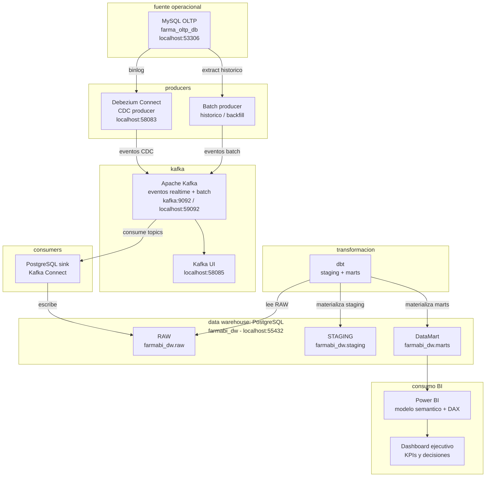
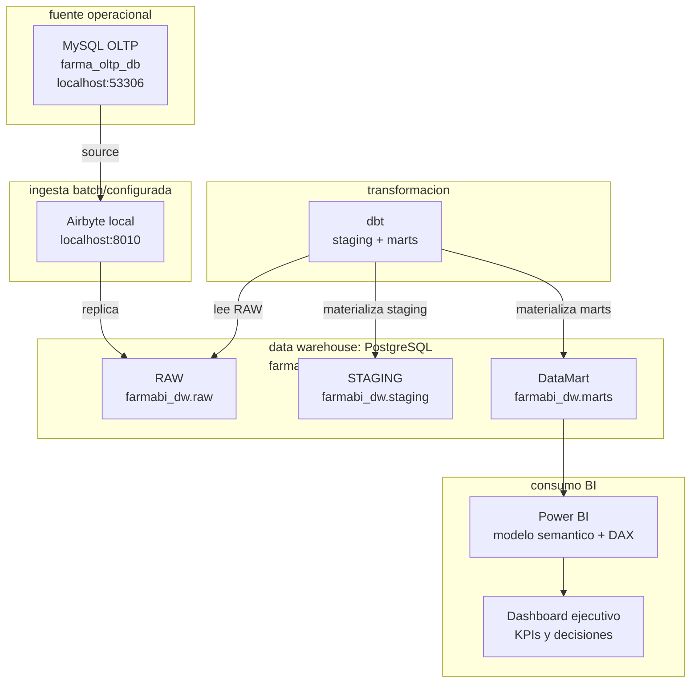

# farmabi - Business Intelligence

Curso practico de Business Intelligence para construir una solucion analitica completa desde una base transaccional hasta un modelo consumible en Power BI. El curso integra definicion del problema de negocio, requerimientos analiticos, modelado dimensional, construccion del Data Warehouse, pipelines de ingesta, modelo semantico, visualizacion, gobierno del dato y sustentacion tecnica.

[`farmabi`](https://github.com/262bi/farmabi) es un laboratorio BI reproducible para implementar un flujo completo de datos:

```text
MySQL OLTP -> Debezium -> Kafka -> PostgreSQL RAW -> dbt -> PostgreSQL DW -> Power BI
```

!!! note "Versión anterior del curso (2026-1)"
    El ciclo 2026-1 de este curso (entonces bajo la organización `261bi`) ya tiene su propio entorno de desarrollo y sus 16 sesiones construidas, disponibles como referencia:

    - Repositorio: [`261bi/farmabi`](https://github.com/261bi/farmabi)
    - Grabaciones y materiales de sesión: [Google Drive](https://drive.google.com/drive/folders/10G5snPuZMHih_3TkpWQLII_fb9p8PQ_N)

## Implementación vigente

Por ahora **S1-S2** están publicadas; **S3-S16** se muestran abajo únicamente como referencia de los temas del sílabo.

## Producto del curso

Producto del curso = Producto U3:

```text
Solucion BI end-to-end para toma de decisiones, con origen transaccional,
Data Warehouse/DataMart, pipeline de ingesta y transformacion, modelo semantico,
dashboard interactivo, validacion de KPIs, trazabilidad y sustentacion tecnica.
```

Resultado esperado del curso:

Al finalizar el curso, el estudiante analiza un problema de negocio, define requerimientos analiticos y KPIs, modela dimensionalmente una solucion BI, implementa un Data Warehouse/DataMart, construye un pipeline de ingesta y transformacion, desarrolla un modelo semantico y presenta dashboards interactivos en Power BI. La solucion debe incluir evidencias de consistencia de datos, trazabilidad fuente-modelo-KPI, validacion con negocio, gobierno del dato y una demo end-to-end defendida tecnicamente.

## Contenido

### U1: Definicion del sistema de informacion para ejecutivos

Producto U1: diseno funcional y analitico de la solucion BI, con problema de negocio, requerimientos, KPIs, modelo dimensional, metadata y mockup del dashboard.

Resultado esperado U1: el estudiante convierte una necesidad de negocio en una especificacion BI verificable. Define preguntas analiticas, KPIs, hechos, grano, dimensiones, jerarquias, fuentes de datos, mapeo fuente-modelo y una primera propuesta de consumo analitico para ejecutivos.

| Sesion | Tema | Producto de sesion |
|---|---|---|
| [S1](sesiones/S01_Fundamentos_BI_Problema_Negocio.md) | Fundamentos BI: problema de negocio y ciclo BI negocio -> datos -> insight -> decision | Caso de negocio BI delimitado, actores, decisiones esperadas y preguntas analiticas iniciales |
| [S2](sesiones/S02_Requerimientos_Analiticos_KPIs.md) | Requerimientos analiticos y KPIs | Matriz de requerimientos analiticos con KPIs, formulas, dimensiones de analisis y criterios de aceptacion |
| S3 | Modelado dimensional y metadata: hechos, grano, dimensiones, jerarquias, fuentes y mapeo fuente-modelo | Modelo dimensional inicial con hecho principal, dimensiones, grano, jerarquias, diccionario de datos y trazabilidad fuente-modelo |
| S4 | Diseno de la solucion BI: KPIs, mockup del dashboard y consumo analitico | Blueprint de la solucion BI con KPIs priorizados, mockup del dashboard, filtros, usuarios y flujo de consumo |
| S5 | Evaluacion U1 | Documento de diseno BI validado y defendido como base de construccion |

### U2: Construccion del BI

Producto U2: solucion BI implementada con Data Warehouse/DataMart, pipeline de ingesta y transformacion, modelo semantico, metricas, visualizaciones, paneles interactivos, validacion analitica y gobierno del dato.

Resultado esperado U2: el estudiante implementa la solucion BI definida en U1 usando los componentes del laboratorio `farmabi`: MySQL OLTP como fuente, Debezium + Kafka para replica CDC, PostgreSQL RAW/DW como repositorio analitico, SQL/dbt para transformacion, y Power BI para modelo semantico, metricas y visualizacion.

| Sesion | Tema | Producto de sesion |
|---|---|---|
| S6 | Implementacion manual del DW con SQL: ETL manual, transformacion, carga y validacion analitica | DataMart manual construido con SQL, dimensiones/hecho cargados y consultas de validacion analitica |
| S7 | Implementacion del pipeline BI con herramientas: ingesta, CDC, transformacion, carga incremental, optimizacion y SCD | Pipeline BI automatizado o semi-automatizado con replica MySQL -> PostgreSQL, transformaciones dbt y evidencia de carga incremental/CDC/SCD segun alcance |
| S8 | Modelo semantico y metricas BI: OLAP, jerarquias, medidas y agregaciones | Modelo semantico en Power BI con relaciones, jerarquias, medidas DAX y agregaciones validadas |
| S9 | Visualizacion BI base: KPIs, metricas y filtros | Reporte BI base con tarjetas KPI, graficos principales, filtros y lectura inicial de resultados |
| S10 | Diseno de paneles interactivos: drill-down, drill-through, tooltips y segmentacion | Dashboard interactivo con navegacion analitica, segmentadores, tooltips y rutas de exploracion |
| S11 | Interpretacion BI y gobierno del dato: storytelling, trazabilidad y validacion | Historia analitica con hallazgos, trazabilidad fuente-modelo-KPI, reglas de calidad y validacion de consistencia |
| S12 | Evaluacion U2 | Solucion BI construida, validada y presentada con evidencias tecnicas |

### U3: Integracion y toma de decisiones

Producto U3 / producto del curso: solucion BI end-to-end integrada, validada con negocio, documentada y sustentada mediante demo tecnica.

Resultado esperado U3: el estudiante integra ETL, DataMart, modelo semantico y visualizacion en una demo completa orientada a decisiones. La defensa debe mostrar la trazabilidad desde la fuente transaccional hasta los KPIs del dashboard, explicar decisiones de modelado y demostrar consistencia de datos.

| Sesion | Tema | Producto de sesion |
|---|---|---|
| S13 | Integracion completa: ETL + DataMart + Visualizacion | Flujo end-to-end operativo desde MySQL OLTP hasta Power BI, con evidencias de ejecucion |
| S14 | Validacion con negocio: KPIs, trazabilidad y consistencia de datos | Validacion final de KPIs, conciliacion de datos, matriz de trazabilidad y ajustes de consistencia |
| S15 | Sustentacion final: demo end-to-end BI | Demo final de la solucion BI, narrativa ejecutiva y defensa tecnica del aporte |
| S16 | Examen Final | Evaluacion individual de competencias BI y toma de decisiones basada en datos |

## Observaciones sobre las sesiones

- La secuencia esta bien planteada: primero define el sistema BI, luego lo construye y finalmente lo integra para la toma de decisiones.
- S6 y S7 se complementan bien: S6 permite entender el ETL manual y S7 profesionaliza el flujo con herramientas.
- S8 deberia cerrar explicitamente la separacion entre modelo fisico del DataMart y modelo semantico en Power BI, para evitar que el estudiante mezcle responsabilidades.
- S11 conviene mantenerlo antes de la evaluacion U2 porque obliga a validar trazabilidad, calidad e interpretacion antes de presentar el producto.
- En S13 y S14 el foco no deberia ser agregar funcionalidades nuevas, sino integrar, estabilizar y validar la solucion completa.

## Arquitectura farmabi v2026-1



Convencion del diagrama: `farmabi` representa el caso de uso `uso-replica-cdc`. Los producers publican eventos realtime o batch en Kafka; el PostgreSQL sink de Kafka Connect es el consumer que escribe en `farmabi_dw.raw`; dbt transforma el Data Warehouse hacia `staging` y `marts`; Power BI consume el DataMart para el analisis ejecutivo.

## Arquitectura alternativa con Airbyte



Convencion del diagrama: esta variante reemplaza Debezium + Kafka por Airbyte. Airbyte replica datos desde MySQL hacia `farmabi_dw.raw`; dbt materializa `staging` y `marts`; Power BI consume el DataMart.

## Modulos

| Modulo | Rol |
|---|---|
| `oltp-mysql/` | Origen transaccional MySQL con la base `farma_oltp_db` |
| `dw-pg/` | PostgreSQL analitico con la base `farmabi_dw` |
| `ingesta-debezium/` | Ingesta CDC con Debezium + Kafka para eventos realtime e integracion batch |
| `ingesta-airbyte/` | Ingesta batch/configurada con Airbyte como alternativa a Debezium + Kafka |
| `dw-dbt/` | Transformacion con dbt desde `raw` hacia `staging` y `marts` |
| `powerbi/` | Modelo semantico, medidas DAX, reportes y dashboards |
| `docs/` | Libro digital MkDocs con sesiones y guias |

## Flujo de trabajo

1. El alumno analiza el problema de negocio y define requerimientos analiticos antes de construir.
2. El origen transaccional se prepara en `oltp-mysql/` como fuente operacional del caso.
3. El repositorio analitico se levanta en `dw-pg/`, separando capas `raw`, `staging` y `marts`.
4. La ingesta se implementa con `ingesta-debezium/`, usando Kafka como eje para eventos realtime y cargas batch.
5. Las transformaciones se modelan en `dw-dbt/`, construyendo dimensiones, hechos, pruebas y documentacion tecnica.
6. Power BI consume el modelo estrella final desde `marts`, define metricas DAX y construye dashboards.
7. La solucion se valida con consultas SQL, pruebas dbt, conciliacion de KPIs y revision de trazabilidad.
8. El producto final se integra, estabiliza y sustenta como una demo BI end-to-end.

## Enlaces

- [S1 - Fundamentos BI y problema de negocio](sesiones/S01_Fundamentos_BI_Problema_Negocio.md)
- [S2 - Requerimientos Analíticos y KPIs](sesiones/S02_Requerimientos_Analiticos_KPIs.md)
- [Plantilla entregable U1](guias/PLANTILLA_ENTREGABLE_U1_REQUERIMIENTOS_BI_MODELADO_DIMENSIONAL.md)
- [Plantilla entregable U2](guias/PLANTILLA_ENTREGABLE_U2_ETL_CALIDAD_DATOS_DATAMART.md)
- [Plantilla producto del curso U3](guias/PLANTILLA_PRODUCTO_CURSO_U3_BI_END_TO_END.md)
- [Comparativos ventas pedidos](guias/pasos_24_25_comparativos_ventas_pedidos.md)
