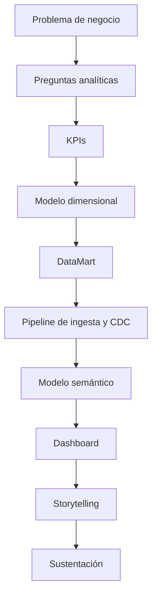

# Guía del Proyecto Sello de Inteligencia de Negocios

## 1. Propósito

El Proyecto Sello integra las sesiones de **Inteligencia de Negocios** alrededor de una solución analítica end-to-end construida sobre el laboratorio `farmabi`. El curso parte de una necesidad de decisión y culmina en un flujo BI completo con datos, modelo dimensional, pipeline, dashboard, trazabilidad y sustentación técnica.

### Competencia o capacidad del proyecto

Al finalizar el Proyecto Sello, el estudiante demuestra que puede transformar una necesidad de decisión en una solución BI end-to-end, aplicando requerimientos analíticos, KPIs, modelado dimensional, Data Warehouse/DataMart, pipeline de ingesta y transformación, modelo semántico, visualización, trazabilidad, interpretación de resultados y sustentación integral de la solución.

### Competencias relacionadas

| Código | Competencia | Relación con el proyecto |
|---|---|---|
| CE041 | Problema analítico y preparación de datos | Evidencia la formulación del problema de decisión, los KPIs y las fuentes de datos del dominio farmacéutico. |
| CE043 | Construcción y experimentación | Evidencia el modelado dimensional, el Data Warehouse/DataMart, el pipeline de ingesta/transformación y el modelo semántico construidos. |
| CE045 | Comunicación y uso del modelo | Evidencia el dashboard, la visualización, el storytelling y el soporte a la toma de decisiones ejecutivas. |

Fuente oficial de los códigos: [Línea de Ciencia de Datos e IA — Competencias y evidencias (CE04)](https://upeuoficial.github.io/planb/lineas/cd-ia/).

```text
Problema de negocio -> KPIs -> Modelo dimensional -> DataMart -> Pipeline -> Modelo semántico -> Dashboard -> Decisión
```

## 2. El Proyecto

Durante el semestre desarrollarás una **solución BI end-to-end para la toma de decisiones**, construida sobre los componentes del laboratorio `farmabi`: un origen transaccional, un mecanismo de ingesta y captura de cambios, un Data Warehouse/DataMart, transformación de datos y un modelo semántico consumido en un dashboard interactivo.

El proyecto debe cumplir estas condiciones:

- Partir de un problema de negocio real y una decisión concreta que la organización necesita tomar.
- Definir requerimientos analíticos y KPIs con fórmula, dimensión de análisis y criterio de aceptación.
- Modelar dimensionalmente el dominio: hecho, grano, dimensiones y jerarquías, con trazabilidad hacia las fuentes.
- Implementar un Data Warehouse/DataMart con pipeline de ingesta y transformación reproducible.
- Construir un modelo semántico con relaciones, jerarquías y medidas, consumido en un dashboard interactivo.
- Ser sustentado técnicamente por todos los integrantes del equipo, desde la fuente transaccional hasta la decisión.

No se considera Proyecto Sello:

- Un dashboard sin problema de negocio ni KPIs definidos.
- Gráficos vistosos sin modelo dimensional ni trazabilidad hacia las fuentes.
- Datos cargados sin validación de consistencia ni reglas de calidad.
- Un pipeline que el equipo no pueda explicar ni reproducir.
- Reportes visuales que no generan interpretación ni recomendación de negocio.
- Una solución que el estudiante no pueda defender desde la fuente transaccional hasta el KPI.

## 3. Evolución del Proyecto

| Unidad | Temas principales | Evolución del proyecto |
|---|---|---|
| Unidad 1: Definición del sistema de información para ejecutivos | Problema de negocio, requerimientos analíticos, KPIs, modelado dimensional, metadata y mockup del dashboard. | Diseño funcional y analítico de la solución BI, validado como base de construcción. |
| Unidad 2: Construcción del BI | DataMart manual con SQL, ingesta y CDC con herramientas, transformación y carga incremental con SCD, modelo semántico, medidas, dashboard con comparación de periodos, storytelling y gobierno del dato. | Solución BI implementada, con pipeline, DataMart, modelo semántico y dashboard validados técnicamente. |
| Unidad 3: Integración y toma de decisiones | Integración end-to-end, paneles interactivos, validación con negocio, trazabilidad y sustentación técnica. | Solución BI final integrada, validada y defendida, orientada a decisiones. |



### Alineamiento por sesiones

Este alineamiento muestra cómo la solución BI pasa de una necesidad de decisión a un producto analítico validado y defendible.

| Sesiones | Contenido central | Avance del proyecto |
|---|---|---|
| S1-S2 | Fundamentos BI (ciclo negocio-datos-insight-decisión), requerimientos analíticos y KPIs. | Brief analítico con problema, decisiones esperadas, preguntas analíticas y matriz de KPIs con fórmulas y criterios de aceptación. |
| S3-S4 | Modelado dimensional, metadata, trazabilidad fuente-modelo y diseño del mockup del dashboard. | Diseño BI con hecho, grano, dimensiones, jerarquías, diccionario de datos y blueprint del dashboard. |
| S5 | Evaluación U1. | Documento de diseño BI validado y sustentado como base de construcción. |
| S6-S7 | DataMart manual con SQL; ingesta y captura de cambios (CDC) con herramientas. | DataMart construido manualmente y pipeline de ingesta/CDC evidenciado con datos reales. |
| S8-S9 | Transformación, carga incremental y SCD; modelo semántico y métricas BI (OLAP, jerarquías, medidas). | Pipeline con carga incremental y SCD; modelo semántico en Power BI con relaciones, jerarquías y medidas validadas. |
| S10-S11 | Dashboard con KPIs de comparación de periodos (año previo/mes anterior); storytelling, trazabilidad y gobierno del dato. | Dashboard con comparativos de periodos y narrativa analítica con trazabilidad fuente-modelo-KPI. |
| S12 | Evaluación U2. | Solución BI construida, validada y presentada con evidencias técnicas. |
| S13-S14 | Integración completa end-to-end con paneles interactivos; validación con negocio, trazabilidad y consistencia de datos. | Flujo end-to-end operativo desde la fuente transaccional hasta el dashboard, validado y estabilizado. |
| S15-S16 | Sustentación final y evaluación individual. | Demo BI end-to-end, narrativa ejecutiva y cierre de competencias. |

## 4. Cronograma

| Hito | Momento | Producto esperado |
|---|---|---|
| S2 | Brief analítico | Problema, usuarios, decisiones esperadas, preguntas analíticas, KPIs iniciales y alcance. |
| S5 | Producto U1 | Documento de diseño BI con KPIs, modelo dimensional, metadata y mockup del dashboard. |
| S12 | Producto U2 | Solución BI implementada con DataMart, pipeline, modelo semántico, dashboard y validación. |
| S15 | Producto final | Demo BI end-to-end con trazabilidad, narrativa ejecutiva y defensa técnica. |
| S16 | Cierre individual | Evaluación individual de competencias BI y toma de decisiones basada en datos. |

## 5. Producto Final

### Repositorio académico y topics

Desde la primera presentación del proyecto, el repositorio debe estar creado y configurado con los topics académicos mínimos. Esta configuración es obligatoria porque permite identificar campus, semestre, línea, tipo de proyecto, curso, sección y grupo.

El detalle oficial del estándar se encuentra en [Estándar transversal de topics para repositorios académicos](https://upeuoficial.github.io/planb/anexos/estandar-topics-repositorios/).

Ejemplo base para BI:

```text
campus-juliaca
semestre-2026-2
linea-cdia
tipo-ps
bi
seccion-g1
grupo-<numero>-<nombre-proyecto>
```

Componentes mínimos:

- Problema de negocio delimitado.
- Matriz de requerimientos analíticos.
- KPIs con fórmula, dimensión de análisis y criterio de aceptación.
- Modelo dimensional con hecho, grano, dimensiones y jerarquías.
- Diccionario de datos y trazabilidad fuente-modelo-KPI.
- Data Warehouse/DataMart implementado.
- Pipeline de ingesta y transformación, con CDC o carga incremental según el alcance.
- Modelo semántico con relaciones, jerarquías y medidas.
- Dashboard interactivo en Power BI, con comparativos de periodos y paneles de exploración.
- Validación de consistencia de datos.
- Reglas básicas de calidad y gobierno del dato.
- Storytelling con hallazgos y recomendaciones.

## 6. Evaluación por competencias

Los criterios se organizan según una matriz común de evaluación de proyectos académicos: problema, requerimientos, modelo, implementación, datos, integración y calidad, validación y sustentación. Cada criterio se adapta al enfoque de inteligencia de negocios y se verifica mediante evidencias del producto, el repositorio y la demostración.

| Dimensión común | Criterio del PS | Capacidad evaluada | Evidencias esperadas |
|---|---|---|---|
| 1. Problema y alcance | Problema y decisión | Delimita una necesidad de información para apoyar decisiones de negocio. | Problema, usuarios, decisión esperada, alcance y preguntas de negocio. |
| 2. Requerimientos o funcionalidad esperada | Requerimientos analíticos | Define indicadores, vistas y necesidades de análisis alineadas al problema. | KPIs, preguntas, criterios de aceptación, mockups o tablero esperado. |
| 3. Diseño, modelo o arquitectura | Modelo BI | Diseña el modelo de datos, dimensiones, métricas y estructura del tablero. | Modelo, diccionario, medidas, relaciones, visualizaciones y decisiones de diseño. |
| 4. Implementación técnica | Dashboard BI | Implementa la solución BI con visualizaciones, filtros y navegación funcional. | Dashboard, medidas, filtros, segmentadores, páginas y capturas. |
| 5. Datos, persistencia o procesamiento | Datos y transformación | Integra, limpia, transforma y modela datos para análisis confiable. | Fuentes, consultas, transformaciones, modelo y validaciones de datos. |
| 6. Integración del producto y calidad técnica | Visualización y calidad técnica | Integra datos, KPIs y hallazgos en una solución BI usable, trazable y documentada. | Dashboard, filtros, visualizaciones, navegación, matriz fuente-modelo-KPI, consistencia y documentación. |
| 7. Validación, pruebas o resultados | Interpretación y resultados | Interpreta resultados y genera recomendaciones útiles para la decisión. | Hallazgos, lectura ejecutiva, recomendaciones y evidencias de resultados. |
| 8. Sustentación técnica y profesional | Sustentación integral | Defiende técnica y profesionalmente la solución BI, evidenciando autoría, comprensión y responsabilidad académica. | Pitch, demo del dashboard, defensa técnica, aporte individual, repositorio, topics y MkDocs o equivalente. |

### Rúbrica

| Criterios | % | A (20) | B (15) | C (10) | D (5) |
|---|---:|---|---|---|---|
| 1. Problema y alcance | 10% | Problema claro, viable y bien delimitado; el alcance responde al contexto y está justificado. | Problema y alcance comprensibles, con algunos límites o justificaciones por precisar. | Problema poco delimitado o alcance parcialmente viable. | Problema confuso, sin alcance definido o sin relación clara con el producto. |
| 2. Requerimientos o funcionalidad esperada | 10% | Funcionalidades o requerimientos completos, coherentes y verificables según la necesidad planteada. | Funcionalidades principales cubiertas, con detalles menores pendientes o poco precisos. | Funcionalidades incompletas o parcialmente alineadas al problema. | Funcionalidades ausentes, inconexas o sin relación verificable con la necesidad. |
| 3. Diseño, modelo o arquitectura | 10% | Diseño, modelo o arquitectura coherente, aplicado y alineado al producto; muestra estructura y decisiones claras. | Diseño funcional con limitaciones menores o decisiones parcialmente justificadas. | Diseño poco claro, incompleto o aplicado de forma parcial. | No presenta diseño, modelo o arquitectura verificable. |
| 4. Implementación técnica | 10% | Implementación correcta, funcional y alineada a los contenidos centrales del curso. | Implementación funcional con detalles técnicos menores por corregir. | Implementación parcial, con errores o uso limitado de los contenidos del curso. | Implementación insuficiente, no funcional o no relacionada con los contenidos del curso. |
| 5. Datos, persistencia o procesamiento | 10% | Los datos se gestionan, almacenan, consultan o procesan correctamente según el tipo de proyecto. | Gestión de datos funcional con detalles menores de consistencia, estructura o procesamiento. | Gestión de datos parcial, limitada o con errores relevantes. | No hay manejo de datos verificable o este impide el funcionamiento del producto. |
| 6. Integración del producto y calidad técnica | 10% | El producto funciona como sistema integrado, ordenado, documentado y reproducible. | Integración funcional con detalles menores de organización, documentación o reproducibilidad. | Integración parcial; existen componentes aislados, desorden o evidencias incompletas. | Componentes desconectados, sin organización técnica ni evidencia reproducible. |
| 7. Validación, pruebas o resultados | 10% | Presenta pruebas, evidencias o resultados claros que comprueban el funcionamiento y el valor del producto. | Presenta evidencias suficientes, con algunos casos o resultados por completar. | Evidencias limitadas, poco claras o con validación parcial. | No presenta pruebas, evidencias ni resultados verificables. |
| 8. Sustentación técnica y profesional | 30% | Explica y defiende el producto con solvencia; demuestra aporte individual, dominio técnico, comunicación clara, repositorio, documentación y actitud profesional. | Sustentación clara y funcional, con detalles menores en defensa técnica, evidencias, comunicación o documentación. | Sustentación parcial; dominio, evidencias, comunicación o aporte individual insuficientemente demostrados. | No sustenta adecuadamente, no demuestra autoría o no presenta evidencias mínimas del producto. |

### Subaspectos de la sustentación integral

La sustentación integral debe representar como mínimo el 30% de la evaluación del proyecto. Se revisa mediante los siguientes subaspectos:

| Subaspecto | Qué observa |
|---|---|
| 1. Defensa técnica | Explicación del problema, modelo dimensional, flujo de datos, KPIs, validaciones, resultados, limitaciones y evidencias generadas. |
| 2. Comunicación y orden | Claridad, estructura, tiempo y lenguaje técnico. |
| 3. Presentación personal y actitud | Puntualidad, vestimenta limpia y adecuada, higiene, cabello ordenado, actitud profesional, respeto, honestidad y coherencia con los valores y principios cristianos de la institución. |
| 4. Aporte individual | Cada integrante demuestra lo que hizo. |
| 5. Repositorio y estándares | Topics, organización, commits, documentación y reproducibilidad. |
| 6. MkDocs o equivalente | Documentación publicada, navegable y alineada al producto. |
| 7. Pitch/demo ejecutiva | Introducción clara del problema, solución y valor, seguida de una demo funcional. |

La sustentación profesional forma parte de la evaluación porque el producto final no solo debe funcionar; también debe ser presentado, explicado y defendido con responsabilidad académica, ética, respeto, honestidad y coherencia con los valores y principios cristianos de la institución.

## 7. Sustentación

La sustentación inicia con un video pitch breve o introducción ejecutiva de 1 a 3 minutos para presentar el problema, la solución, el valor del producto y la participación del equipo o estudiante.

| Momento | Tiempo sugerido | Propósito |
|---|---:|---|
| Exposición técnica y ejecutiva | 10 minutos | Presentar problema, KPIs, modelo, pipeline, dashboard, hallazgos y decisiones. |
| Demostración end-to-end | 5 minutos | Mostrar trazabilidad desde la fuente transaccional hasta el KPI, la visualización y la recomendación. |

Cada integrante debe demostrar una parte verificable: requerimientos, modelo dimensional, pipeline, DataMart, Power BI, validación, storytelling o documentación. La demo debe evidenciar datos reales del proyecto, no solo pantallas estáticas.

## 8. Resultado Esperado

Al finalizar el curso, el estudiante debe demostrar que puede transformar datos transaccionales en una solución BI útil para tomar decisiones.

```text
Necesidad de decisión -> Datos -> Modelo -> Pipeline -> Dashboard -> Insight -> Recomendación
```

## Anexo. Secuencia sugerida de presentación

La presentación puede organizarse con una secuencia breve de apoyo visual. El video pitch o introducción ejecutiva abre la sustentación y no reemplaza la demo ni la defensa técnica.

| Orden | Slide o momento | Propósito | Competencia evidenciada |
|---:|---|---|---|
| 1 | Título del proyecto y equipo | Identificar el proyecto, integrantes y dominio elegido. | CE045 |
| 2 | Video pitch o introducción ejecutiva | Presentar problema, solución, valor y participación del equipo. | CE045 |
| 3 | 1. Problema y alcance | Explicar el problema de negocio y la decisión que se busca apoyar. | CE041 |
| 4 | KPIs y preguntas analíticas | Presentar indicadores, fórmulas, dimensiones de análisis y criterios de aceptación. | CE041 |
| 5 | Fuentes y modelo dimensional | Mostrar fuentes, hecho, grano, dimensiones y jerarquías. | CE041 + CE043 |
| 6 | Pipeline y DataMart | Explicar ingesta, CDC, transformación, carga y validaciones. | CE043 |
| 7 | Modelo semántico | Presentar relaciones, jerarquías y medidas. | CE043 |
| 8 | Dashboard | Mostrar visualizaciones, comparativos de periodos, filtros y hallazgos. | CE045 |
| 9 | Demo end-to-end | Evidenciar trazabilidad desde la fuente transaccional hasta el KPI y la recomendación. | CE043 + CE045 |
| 10 | 4. Aporte individual | Indicar qué hizo cada integrante. | CE045 |
| 11 | 5. Repositorio y estándares | Mostrar repositorio, topics, estructura, documentación publicada en MkDocs o equivalente, y reproducibilidad. | CE045 |
| 12 | Limitaciones y mejoras | Reconocer límites del análisis y mejoras posibles. | CE045 |

## Anexo. Plantilla mínima de documentación MkDocs o equivalente

La documentación publicada no reemplaza al informe. Su función es permitir que otra persona comprenda, ejecute, revise y verifique el producto desde el repositorio.

| Página o sección | Contenido mínimo | Evidencia esperada |
|---|---|---|
| Inicio | Nombre del proyecto, problema, solución, curso o cursos, integrantes y enlace al repositorio. | Presentación clara del producto. |
| Instalación o ejecución | Requisitos, dependencias, configuración y comandos para ejecutar el proyecto. | Instrucciones reproducibles. |
| Uso del sistema | Flujo principal, pantallas, comandos, endpoints, notebooks o casos de uso según corresponda. | Guía breve para probar el producto. |
| Arquitectura o estructura | Diagrama, componentes, carpetas principales y decisiones técnicas. | Vista técnica comprensible. |
| Módulos o funcionalidades | Descripción de las funciones principales del producto. | Relación entre funcionalidades y problema. |
| Datos | Modelo, archivos, base de datos, datasets, fuentes o estructura de almacenamiento según el curso. | Evidencia de gestión de datos. |
| Pruebas y evidencias | Casos de prueba, capturas, resultados, métricas, validaciones o salidas generadas. | Verificación del funcionamiento. |
| Equipo y aporte individual | Integrantes, responsabilidades, aportes y evidencias de participación. | Autoría verificable. |
| 5. Repositorio y estándares | Topics académicos, estructura, commits, ramas si aplica y criterios de reproducibilidad. | Cumplimiento de estándares técnicos. |
| Limitaciones y mejoras | Restricciones del producto y mejoras futuras priorizadas. | Cierre reflexivo y realista. |

La documentación debe estar disponible desde las primeras presentaciones y crecer con el proyecto. Para FP puede ser una documentación sencilla; para proyectos integradores y cursos avanzados debe ser más completa y técnica.

## Anexo. Plantilla sugerida de informe del proyecto

El informe debe documentar el producto de manera breve, verificable y alineada a las competencias evaluadas. No reemplaza la demo ni la sustentación; organiza las evidencias del proyecto.

| Sección | Contenido mínimo | Evidencia esperada |
|---|---|---|
| Portada | Nombre del proyecto, curso, sección, integrantes, docente y semestre. | Datos completos del equipo. |
| Resumen del proyecto | Problema de negocio, solución BI y valor para la decisión. | Síntesis de 8 a 12 líneas. |
| Competencia y alcance | Competencia/capacidad del proyecto y competencias relacionadas. | CE041, CE043 y CE045 vinculadas al producto. |
| Problema y KPIs | Necesidad de decisión, preguntas, KPIs y criterios de aceptación. | Tabla de KPIs, fórmulas y preguntas. |
| Fuentes y calidad de datos | Origen de datos, estructura, validaciones y limitaciones. | Diccionario, perfilado o evidencias de calidad. |
| Modelo dimensional | Hecho, grano, dimensiones, jerarquías y trazabilidad. | Diagrama o tabla dimensional. |
| Pipeline y DataMart | Ingesta, transformación, carga y modelo semántico. | Scripts, consultas, capturas y resultados. |
| Dashboard e interpretación | Visualizaciones, filtros, hallazgos y recomendaciones. | Capturas, demo y lectura ejecutiva. |
| Validación | Consistencia fuente-modelo-KPI y resultados. | Pruebas, consultas y evidencias. |
| Repositorio y documentación | Repositorio, topics, estructura, instrucciones y documentación publicada. | URL del repositorio y MkDocs o equivalente. |
| 4. Aporte individual | Responsabilidad de cada integrante. | Tabla de tareas, commits o evidencias por integrante. |
| Limitaciones y mejoras | Límites del análisis y mejoras posibles. | Lista priorizada y realista. |
