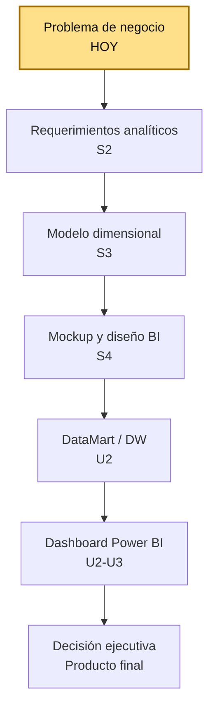
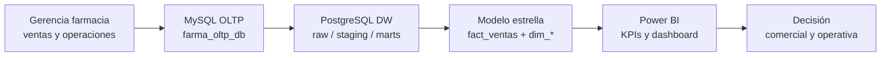

# S1 - Fundamentos BI y problema de negocio

## 1. Introducción

Tiempo: 20 min.

### 1.1 Presentación de la sesión

Una solución de Business Intelligence no empieza en Power BI. Empieza con una decisión de negocio que necesita mejor información para tomarse. Esta sesión construye ese punto de partida: el caso de negocio BI de `farmabi`, delimitando el problema, los actores, las decisiones esperadas y las preguntas analíticas que guiarán todo el curso.

### 1.2 Índice

1. Problema de negocio y ciclo BI.
2. Del negocio a los datos.
3. Del dato al insight.
4. Del insight a la decisión.

### 1.3 Propósito de aprendizaje

Al concluir la clase, estarás en condiciones de:

- **Identificar** el ciclo de Inteligencia de Negocios y reconocer los componentes de una arquitectura BI.
- **Analizar** el caso organizacional `farmabi` para identificar decisiones ejecutivas soportadas por datos, actores, preguntas analíticas, fuentes de datos y primeras evidencias disponibles en el repositorio.

### 1.4 Producto de sesión

Caso de negocio BI delimitado para `farmabi`, con decisiones esperadas, actores, preguntas analíticas iniciales, fuentes de datos y primer mapa del flujo de datos.

### 1.5 Metodología

**Tabla 1. Metodología de la sesión**

| Actividades a Realizar en el Periodo | Orientaciones generales (Orientaciones Metodológicas) | Material de estudio recomendado |
|---|---|---|
| Revisión previa individual | Leer el sílabo de la Unidad 1 y el caso de la farmacia con ventas, pedidos y despacho (ver 1.6). Trabajo individual, antes de clase; sin instalación previa requerida para esta sesión. | Sílabo BI U1. |
| Clase presencial | Construcción guiada del caso de negocio BI: flujo del laboratorio, decisiones, preguntas analíticas, mapeo a fuentes y tabla Negocio-Datos-Insight-Decisión. Trabajo individual, siguiendo al docente paso a paso; consulta inmediata ante dudas sobre el dominio farmacéutico o las tablas del repositorio. | Pasos 3.1 a 3.6 de esta guía. |
| Evaluación formativa | Revisión en clase del alcance BI delimitado por cada estudiante o equipo. La evidencia se completa y sustenta de forma individual, fuera del aula, según los criterios mínimos de la sección 4.2. | Plantilla de evidencia individual (4.1), rúbrica de evaluación (5.4). |

### 1.6 Motivación de la sesión

#### 1.6.1 Caso: farmacia con ventas, pedidos y despacho

Una cadena de farmacia registra clientes, vendedores, productos, categorías, familias, pedidos y detalles de pedido en una base transaccional. La gerencia necesita responder preguntas como:

- ¿Cuánto vendemos realmente después de descuentos?
- ¿Qué productos, familias o categorías aportan más margen?
- ¿Qué vendedores o clientes concentran ventas?
- ¿Qué pedidos tardan más en confirmarse, despacharse o entregarse?
- ¿Cómo evolucionan ventas, margen y descuentos en el tiempo?

El problema no es solo tener datos. El reto BI es convertir esos datos operacionales en información confiable para tomar decisiones.

Pregunta guía:

```text
¿Qué decisión de negocio queremos mejorar y qué datos necesitamos para sostenerla?
```

**Preguntas de análisis**

**Activación de conocimientos previos**

1. ¿Qué problemas genera tomar decisiones sin datos confiables en este caso?
2. ¿Qué decisión priorizarías primero si fueras el gerente comercial de la farmacia?

**Comprensión del ciclo BI**

1. ¿Por qué el reto de BI no es solo "tener datos" sino convertirlos en información confiable?

### 1.7 Ubicación en el curso

- Unidad: U1 - Definición del sistema de información para ejecutivos.
- Producto de unidad: diseño funcional y analítico de la solución BI.
- Producto del curso: Proyecto Sello: solución BI end-to-end para toma de decisiones, con origen transaccional, Data Warehouse/DataMart, pipeline de ingesta y transformación, modelo semántico, dashboard interactivo, validación de KPIs, trazabilidad y sustentación técnica.
- Avance del producto en esta sesión: problema de negocio, actores, decisiones y preguntas analíticas iniciales.

Roadmap del producto BI:

**Figura 1. Roadmap del producto BI de `farmabi`**



Hoy se delimita el primer componente real de la U1: el caso de negocio BI. En las siguientes sesiones se agregan requerimientos analíticos con KPIs, modelado dimensional y el mockup del dashboard. La evaluación U1 valida el diseño funcional y analítico completo construido con esos componentes.

## 2. Explica

Tiempo: 15 min.

### 2.1 Problema de negocio y ciclo BI

Las decisiones son acciones que se toman para resolver un problema: evitar o reducir efectos negativos, aprovechar oportunidades, eliminar debilidades o potenciar fortalezas. Herbert A. Simon distingue dos tipos de decisiones:

- **Programadas**: rutinarias y repetitivas, se toman con reglas o procedimientos predefinidos; situaciones bien estructuradas, automatizables.
- **No programadas**: complejas, sin reglas predefinidas; situaciones no estructuradas que requieren juicio experto.

Y describe 4 fases para resolver un problema:

**Tabla 2. Fases para resolver un problema según Herbert Simon**

| Fase | Pregunta que responde | Descripción |
|---|---|---|
| 1. Inteligencia | ¿Cuál es el problema? | Buscar situaciones insatisfechas que exigen una solución. |
| 2. Diseño | ¿Qué opciones tengo? | Generar alternativas de solución. |
| 3. Selección | ¿Qué opción voy a elegir? | Seleccionar una solución. |
| 4. Revisión | ¿Qué consecuencias tuvo mi decisión? | Evaluar la solución realizada. |

Business Intelligence no empieza en Power BI. Empieza con un **problema de negocio**: una situación real que exige tomar una decisión mejor informada (fase 1, Inteligencia). BI existe para dar soporte informado sobre todo a esa primera fase y a la última (Revisión: evaluar con datos qué consecuencias tuvo la decisión).

BI es el proceso de transformar datos en información, información en conocimiento y conocimiento en decisiones. El **ciclo BI** resume ese proceso:

```text
negocio -> datos -> insight -> decisión
```

**Tabla 3. Etapas del ciclo BI**

| Etapa | Pregunta que responde |
|---|---|
| Negocio | ¿Qué decisión necesitamos mejorar? |
| Datos | ¿Qué información real respalda esa decisión? |
| Insight | ¿Qué patrón o comparación hace legible ese dato? |
| Decisión | ¿Qué acción concreta se toma con ese insight? |

Ejemplo general del ciclo: Negocio = las ventas han disminuido en una categoría de productos; Datos = ventas por producto, fecha, tienda, cliente y categoría; Insight = la categoría baja más en determinadas fechas o zonas; Decisión = lanzar promoción, cambiar estrategia comercial o ajustar inventario.

En `farmabi`, el ciclo completo del curso se implementa así (S1 solo trabaja la primera etapa; el resto se construye en las siguientes sesiones):

**Figura 2. Flujo de datos del ciclo BI en farmabi, de la fuente OLTP a la decisión**



#### 2.1.1 Conceptos clave de la sesión

**Tabla 4. Conceptos clave de la sesión**

| Concepto | Sentido en el curso |
|---|---|
| Problema de negocio | Situación que requiere una decisión mejor informada. |
| KPI | Indicador clave de desempeño que ayuda a evaluar resultados relevantes del negocio. |
| Métrica | Valor medible asociado a una actividad o proceso. |
| Pregunta analítica | Pregunta que puede responderse con datos. |
| Fuente operacional | Sistema donde nacen los datos del negocio. |
| Data Warehouse | Repositorio analítico centralizado para integrar información. |
| DataMart | Subconjunto del Data Warehouse orientado a un área o proceso específico. |
| Insight | Hallazgo relevante que orienta la decisión. |
| Dashboard | Visualización interactiva para interpretar indicadores y resultados. |
| Consumo ejecutivo | Forma en que el usuario final explora KPIs y hallazgos. |

### 2.2 Del negocio a los datos

Una vez identificada la decisión que se quiere mejorar, el siguiente paso del ciclo BI es ubicar qué datos reales pueden respaldarla. Esto exige reconocer dónde nace cada dato: la **fuente operacional**.

En `farmabi`, la fuente operacional es una base transaccional MySQL (`farma_oltp_db`) que registra la operación diaria de una cadena de farmacia:

**Tabla 5. Tablas OLTP de farmabi y su uso analítico probable**

| Tabla OLTP | Uso analítico probable |
|---|---|
| `clientes` | Análisis por cliente. |
| `vendedores` | Análisis comercial por vendedor. |
| `familias`, `categorias`, `productos` | Análisis de producto. |
| `pedidos` | Estado, fechas y ciclo operativo. |
| `pedido_detalles` | Cantidades, precios, descuentos, costos y venta. |

El repositorio ya contiene el laboratorio completo que este flujo va a usar durante el curso, aunque en S1 solo se explora la fuente operacional:

**Tabla 6. Componentes del laboratorio farmabi y su rol en el caso BI**

| Carpeta o archivo | Rol en el caso BI |
|---|---|
| `oltp-mysql/` | Base transaccional MySQL `farma_oltp_db` (ya construida y operativa desde S1). |
| `dw-pg/` | PostgreSQL analítico `farmabi_dw` (se construye en U2). |
| `ingesta-debezium/` | Ingesta CDC con Debezium + Kafka (U2). |
| `ingesta-airbyte/` | Variante batch/configurada de ingesta (U2). |
| `dw-dbt/` | Transformación hacia `staging` y `marts` (U2). |
| `powerbi/` | Medidas DAX, PBIX y reportes (U2-U3). |

Ir del negocio a los datos no es solo "conectar una base": es verificar que existen los campos correctos para responder la pregunta. Por ejemplo, para saber si un pedido se entrega a tiempo se necesitan `pedidos.fecha_creacion` y `pedidos.fecha_entrega`; para calcular una venta neta se necesitan `pedido_detalles.cantidad`, `precio_venta_unitario` y `total_descuento_unitario`.

### 2.3 Del dato al insight

Una arquitectura BI conecta tres niveles de sistemas: los **sistemas transaccionales (TPS)** donde nace el dato operativo (en `farmabi`, `farma_oltp_db`), los **sistemas de apoyo a la toma de decisiones (DSS)** que lo transforman en KPIs, y los **sistemas de información para ejecutivos (EIS)** que lo presentan como dashboard. Data Analytics es la habilidad de transformar datos en reportes interactivos de apoyo a la decisión: el dato describe una situación actual; el insight compara esa situación con lo esperado y revela un patrón accionable.

Ejemplo: *"La caída de ventas en zapatos está asociada a quiebres de stock, lo que está afectando la rentabilidad"* es un insight porque conecta un hallazgo (caída de ventas) con una causa (quiebre de stock) y un impacto (rentabilidad) — no es un dato suelto, es una interpretación accionable.

Un dato aislado no es un insight. `total_descuento_unitario = 1.00` en una fila de `pedido_detalles` no le dice nada a un gerente. Un **insight** aparece cuando ese dato se agrega, se compara o se pone en contexto de forma que alguien pueda leerlo y actuar:

**Tabla 7. De un dato aislado a un insight accionable**

| Solo dato | Insight |
|---|---|
| `pedido_detalles.total_descuento_unitario = 1.00` en una fila | "Los descuentos representan el 8% del margen de la familia TABLETA este mes." |
| `pedidos.fecha_entrega` de un pedido | "El 30% de los pedidos de la vendedora X tarda más de 48 horas en entregarse." |
| `productos.precio_venta` de un producto | "Los productos de la familia INYECTABLE generan el doble de margen que TABLETA." |

Convertir dato en insight requiere tres operaciones típicas: **agregar** (sumar, promediar, contar), **comparar** (contra un periodo, un vendedor, una categoría) y **contextualizar** (relacionar el número con un objetivo o umbral de negocio). Esa transformación se automatiza recién en U2 (SQL manual en S6, herramientas de ingesta y transformación en S7-S9); en S1 se practica de forma manual y conceptual al formular las preguntas analíticas de la sección 3.3.

#### 2.3.1 Niveles de analítica

No todo insight tiene la misma profundidad. Existen cuatro niveles de analítica, de menor a mayor complejidad:

**Tabla 8. Niveles de analítica**

| Nivel | Qué hace | Pregunta de análisis (ejemplo) |
|---|---|---|
| Analítica descriptiva | El pasado (descriptivo). | ¿Cuál fue la utilidad generada por los productos vendidos en el último año? |
| Analítica de diagnóstico | Establece hipótesis (relacional y/o explicativo de la causalidad). | ¿Por qué las ventas de noviembre fueron menores que las de octubre? (explicativo) |
| Analítica predictiva | Estima el valor de una variable desconocida a partir de datos pasados (predictivo). | ¿Cuánto consumirá un cliente en su próxima visita? |
| Analítica prescriptiva | Recomendaciones o tratamiento (aplicada). | Ofrecerle un combo u oferta personalizado a partir de esa predicción. |

En `farmabi`, el curso trabaja principalmente **analítica descriptiva y de diagnóstico** (KPIs, comparativos de periodos, causas de variación) hasta la Unidad 3. Predictiva y prescriptiva quedan fuera del alcance del curso, pero conviene reconocer los cuatro niveles desde S1 para ubicar qué tipo de pregunta analítica se está formulando en cada caso.

### 2.4 Del insight a la decisión

Un insight solo tiene valor si llega a la persona correcta, en el momento correcto, y cambia lo que esa persona hace. Si nadie actúa sobre "los descuentos representan el 8% del margen", el insight fue inútil.

Errores frecuentes que rompen este último paso del ciclo:

**Tabla 9. Errores frecuentes al pasar del insight a la decisión**

| Problema | Riesgo | Corrección |
|---|---|---|
| Empezar por gráficos | Dashboard bonito sin decisión clara. | Definir decisión y pregunta primero. |
| Confundir dato con KPI | Medidas sin acción. | Relacionar cada KPI con un objetivo. |
| Pedir todos los datos | Alcance inmanejable. | Priorizar un proceso de negocio. |
| No definir usuario | Visualizaciones genéricas. | Identificar al actor ejecutivo. |
| No mapear fuentes | No hay trazabilidad. | Vincular cada pregunta con tabla/campo. |

Por eso el ciclo BI se recorre completo desde S1: sin un actor identificado y una decisión priorizada (negocio), no importa qué tan bien se transformen los datos (datos) ni qué tan claro sea el hallazgo (insight) — nunca se llega a una decisión real.

## 3. Aplica: actividad práctica guiada

Tiempo: 3h.

**Actividad:** construcción guiada del caso de negocio BI de `farmabi`, desde el flujo del laboratorio hasta la tabla Negocio-Datos-Insight-Decisión.

**Propósito de la actividad:** delimitar, con la guía del docente, el problema de negocio, las decisiones ejecutivas, las preguntas analíticas y las fuentes de datos que sostienen el caso `farmabi`, verificando cada avance antes de continuar al siguiente paso.

**Orientaciones metodológicas:** en clase, el docente guía la lectura del caso `farmabi` y la construcción del documento de definición BI paso a paso frente a la clase; los estudiantes replican cada paso identificando decisiones, preguntas analíticas y fuentes reales del repositorio, verificando cada avance antes de continuar al siguiente.

**Actividades para realizar:**

- **3.1** Reconocer el flujo del laboratorio.
- **3.2** Identificar decisiones de negocio.
- **3.3** Formular preguntas analíticas.
- **3.4** Mapear preguntas a fuentes.
- **3.5** Definir el alcance inicial.
- **3.6** Construir la tabla Negocio-Datos-Insight-Decisión.

### 3.1 Reconocer el flujo del laboratorio

**Producto del paso:** mapa simple del flujo de datos del curso.

Lee la arquitectura del repositorio y registra el flujo base:

```text
MySQL OLTP -> Debezium/Kafka o Airbyte -> PostgreSQL RAW -> dbt -> marts -> Power BI
```

Responde:

1. ¿Dónde nacen los datos?
2. ¿Dónde aterrizan los datos crudos?
3. ¿Dónde se transforma el modelo analítico?
4. ¿Qué consume Power BI?

### 3.2 Identificar decisiones de negocio

**Producto del paso:** lista priorizada de decisiones ejecutivas.

Propón al menos cinco decisiones posibles. Ejemplos:

**Tabla 10. Decisiones de negocio propuestas para el caso farmabi**

| Decisión | Actor | Frecuencia |
|---|---|---|
| Priorizar categorías con mayor margen | Gerencia comercial | Semanal |
| Evaluar cumplimiento de ventas | Jefatura comercial | Mensual |
| Detectar pedidos con lead time alto | Operaciones | Diario |
| Revisar descuentos excesivos | Finanzas / comercial | Semanal |
| Identificar clientes de mayor valor | Gerencia | Mensual |

Selecciona una decisión principal para el proyecto del equipo.

### 3.3 Formular preguntas analíticas

**Producto del paso:** banco inicial de preguntas BI.

Cada pregunta debe poder responderse con datos del caso.

Ejemplos:

1. ¿Cuál es la venta neta mensual y su variación contra el periodo anterior?
2. ¿Qué familias de producto generan mayor margen bruto?
3. ¿Qué vendedores concentran mayor venta neta?
4. ¿Qué porcentaje de pedidos se entrega dentro de 24 horas?
5. ¿Cuál es el ticket promedio por cliente o categoría?

### 3.4 Mapear preguntas a fuentes

**Producto del paso:** matriz pregunta-fuente.

**Tabla 11. Matriz pregunta-fuente del caso farmabi**

| Pregunta | Tablas fuente | Campos candidatos |
|---|---|---|
| Venta neta mensual | `pedidos`, `pedido_detalles` | `fecha_creacion`, `cantidad`, `precio_venta_unitario`, `total_descuento_unitario` |
| Margen por familia | `pedido_detalles`, `productos`, `familias` | `precio_venta_unitario`, `precio_compra_unitario`, `familia_id` |
| Lead time de entrega | `pedidos` | `fecha_creacion`, `fecha_entrega` |
| Descuento aplicado | `pedido_detalles` | `total_descuento_unitario`, `precio_venta_unitario` |

### 3.5 Definir el alcance inicial

**Producto del paso:** alcance BI de S1.

Completa:

```text
Proceso de negocio principal:
Decisión que se desea mejorar:
Usuario ejecutivo principal:
Preguntas analíticas priorizadas:
Fuentes disponibles:
Fuentes no disponibles o supuestos:
Riesgos de calidad de datos:
```

### 3.6 Construir la tabla Negocio-Datos-Insight-Decisión

**Producto del paso:** tabla consolidada del ciclo BI aplicado a `farmabi`.

El docente modela primero un ejemplo con el caso `farmabi`:

**Tabla 12. Ejemplo guiado del ciclo Negocio-Datos-Insight-Decisión**

| Negocio | Datos | Insight | Decisión |
|---|---|---|---|
| Caída de rentabilidad en una familia de productos | Ventas y costos por familia (`pedido_detalles`, `productos`, `categorias`, `familias`) | La familia vende bien pero deja poco margen por los descuentos aplicados | Ajustar precio o renegociar costo con el proveedor |

Luego, toma dos de las decisiones priorizadas en 3.2 y complétalas siguiendo la secuencia completa del ciclo BI:

**Tabla 13. Ciclo Negocio-Datos-Insight-Decisión aplicado por el estudiante**

| Negocio | Datos | Insight | Decisión |
|---|---|---|---|
| Tu decisión 1 | | | |
| Tu decisión 2 | | | |

Este es el mismo esquema Negocio → Datos → Insight → Decisión que vas a aplicar de forma autónoma en la sección 4.

## 4. Crea: actividad autónoma

Tiempo: 4h fuera del aula.

### 4.1 Actividad

Continuación autónoma e individual del caso de negocio BI de `farmabi`, consolidando la decisión priorizada, las preguntas analíticas y el mapeo a fuentes trabajados de forma guiada en la sección 3.

Completa y evidencia estas tareas:

1. Decisión de negocio priorizada.
2. Actor ejecutivo principal.
3. Mínimo cinco preguntas analíticas.
4. Matriz pregunta-fuente.
5. Tabla Negocio-Datos-Insight-Decisión con al menos dos decisiones completas.

### 4.2 Propósito

Que cada estudiante demuestre, de forma individual y fuera del aula, que puede reproducir el patrón construido en clase sin el acompañamiento del docente.

El caso `farmabi` es el mismo dominio que se trabaja durante todo el curso: esta actividad no cambia de dominio, sino que exige que cada estudiante sustente su propio aporte individual dentro del caso compartido, con datos y decisiones que pueda defender por sí solo.

### 4.3 Indicaciones

Entrega un PDF con el siguiente nombre:

```text
S01_Equipo##_ApellidoNombre.pdf
```

Cada captura de pantalla del informe debe mostrar, sin recortar, el reloj del sistema (fecha y hora) y tu usuario o foto de perfil (Windows, VS Code o navegador) visibles en pantalla — es lo que permite verificar que la evidencia es tuya y que corresponde al momento real de tu trabajo.

#### 4.3.1 Estructura del informe

**Datos del estudiante**

- Nombre:
- Equipo:
- Sesión: S01 - Fundamentos BI y problema de negocio
- Rol o aporte realizado:
- Link de GitHub:

**Evidencia técnica**

Incluye capturas o extractos con una breve explicación debajo de cada uno, organizados en los mismos 4 bloques de la rúbrica (4.6) — así queda claro qué evidencia corresponde a cada criterio evaluado:

1. *Problema y decisión*
    - Lista de decisiones ejecutivas evaluadas (3.2).
    - Alcance inicial completo (3.5).
2. *Preguntas analíticas*
    - Banco de preguntas analíticas (3.3).
3. *Mapeo a fuentes*
    - Matriz pregunta-fuente (3.4).
4. *Comprensión del ciclo BI*
    - Mapa del flujo de datos del laboratorio (3.1).
    - Tabla Negocio-Datos-Insight-Decisión (3.6).

**Error o hallazgo**

Describe al menos un riesgo de calidad o trazabilidad detectado en las fuentes del caso:

- Qué ocurrió o qué limitación encontraste.
- Cómo lo identificaste.
- Cómo lo documentaste o qué supuesto tomaste.

**Reflexión técnica breve**

Responde en 5 a 8 líneas:

```text
¿Por qué una solución BI debe empezar por una decisión y no por un gráfico?
```

### 4.4 Criterios mínimos de aceptación

La evidencia individual se considera completa si:

- El caso de negocio está delimitado.
- Las preguntas analíticas son medibles.
- Las fuentes pertenecen al repositorio `farmabi`.
- El documento conecta negocio, datos y decisión.
- La evidencia identifica un aporte individual verificable.
- Cada captura de la evidencia técnica muestra el reloj del sistema y el usuario/perfil visible, sin recortar.
- Las fechas y horas de las capturas son coherentes con el historial de commits de su repositorio en GitHub.
- Incluye un error o hallazgo técnico diagnosticado.
- Incluye la reflexión técnica breve solicitada.

### 4.5 Preguntas de defensa

1. ¿Qué decisión de negocio guía tu solución BI?
2. ¿Qué usuario consumirá el dashboard?
3. ¿Qué pregunta analítica consideras más importante?
4. ¿Qué tabla fuente respalda esa pregunta?
5. ¿Qué riesgo aparece si no se define el problema antes del dashboard?

### 4.6 Rúbrica de evaluación

**Tabla 14. Rúbrica de evaluación**

| Criterio | Peso (%) | A (20 pts) | B (15 pts) | C (10 pts) | D (5 pts) | Nivel obtenido |
|---|---:|---|---|---|---|---:|
| 1. Problema y decisión* | 25 | Delimita problema, actor y decisión con claridad ejecutiva, aplicado al caso `farmabi`. | Define problema y decisión comprensibles. | Presenta una idea general sin actor claro. | No delimita el problema. | |
| 2. Preguntas analíticas* | 25 | Formula preguntas medibles, priorizadas y conectadas al negocio (mínimo cinco). | Formula preguntas medibles. | Preguntas vagas o poco medibles. | No formula preguntas útiles. | |
| 3. Mapeo a fuentes* | 25 | Relaciona cada pregunta con tablas y campos reales del repositorio `farmabi`. | Relaciona preguntas con tablas reales. | Mapeo incompleto o genérico. | No usa fuentes reales. | |
| 4. Comprensión del ciclo BI* | 25 | Explica negocio -> datos -> insight -> decisión aplicado a `farmabi`, con la tabla Negocio-Datos-Insight-Decisión completa. | Explica el ciclo BI de forma correcta. | Explicación parcial. | No explica el ciclo. | |

\* Agregado manual.

Nota final = suma de (`Peso` / 100 × `Puntos del nivel obtenido`) = ____ / 20.

Para usar la rúbrica con IA, solicita:

```text
Evalúa el PDF usando la rúbrica de la sesión.
Para cada criterio selecciona el nivel obtenido usando la escala A=20, B=15, C=10, D=5 puntos.
Justifica brevemente cada nivel asignado.
Verifica que cada captura muestre reloj del sistema y usuario/perfil visible, y que las fechas sean coherentes con el historial de commits de GitHub. Si falta esta evidencia o hay inconsistencias, indícalo explícitamente antes de calificar.
Calcula la nota final con la fórmula: suma de (Peso/100 × Puntos del nivel obtenido), directamente sobre 20.
Indica 2 fortalezas y 2 recomendaciones.
```

## 5. Cierre

Tiempo: 5 min.

**Resumen breve:** hoy se delimitó el caso de negocio BI de `farmabi`: problema, actores, decisiones priorizadas, preguntas analíticas y su mapeo a las fuentes reales del repositorio.

**Dinámica participativa:** en una ronda rápida (o con una herramienta digital tipo formulario o encuesta en vivo), cada estudiante comparte en una frase la decisión de negocio que priorizó y por qué.

**Metacognición:** cada estudiante responde en voz alta o por escrito: ¿qué parte de la sesión te costó más entender, y cómo la resolviste?

**Proyección:** el caso delimitado hoy se retoma en S2 para construir los requerimientos analíticos con KPIs, y el hábito de partir de una decisión de negocio antes de tocar datos o dashboards aplica a cualquier proyecto BI profesional, dentro o fuera del curso.

## Bibliografía

1. Simon, H. A. (1977). *The new science of management decision* (Rev. ed.). Prentice-Hall.
2. Kimball, R., & Ross, M. (2013). *The data warehouse toolkit: The definitive guide to dimensional modeling* (3rd ed.). Wiley.
