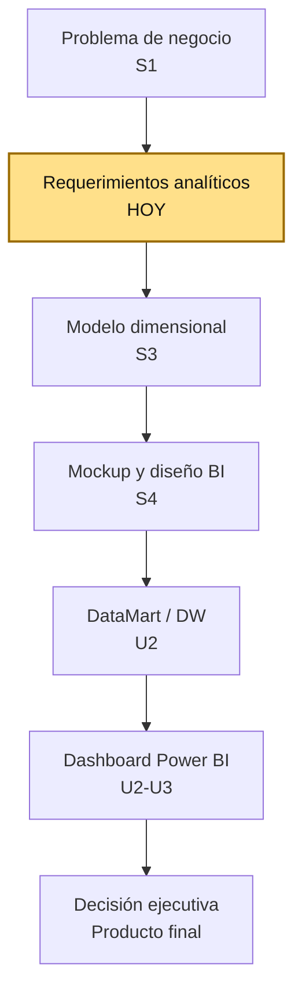

# S2 - Requerimientos Analíticos y KPIs

## 1. Introducción

Tiempo: 20 min.

### 1.1 Presentación de la sesión

Las preguntas analíticas de S1 ("¿qué familias generan más margen?") todavía no son medibles: falta la fórmula exacta, la meta y la frecuencia con la que se van a evaluar. Esta sesión convierte esas preguntas en KPIs formales — indicadores con fórmula, dimensiones de análisis y criterio de aceptación — consolidados en la matriz de requerimientos analíticos que sostiene el modelo dimensional de S3.

### 1.2 Índice

1. De la pregunta analítica al KPI.
2. Anatomía de un KPI: fórmula, meta y frecuencia.
3. Dimensiones de análisis: por dónde se puede cortar un KPI.
4. Criterios de aceptación de un requerimiento analítico.

### 1.3 Propósito de aprendizaje

Al concluir la clase, estarás en condiciones de:

- **Formular** KPIs medibles a partir de las preguntas analíticas del caso `farmabi`, especificando fórmula, meta, frecuencia y dimensiones de análisis, y **consolidarlos** en una matriz de requerimientos analíticos con criterios de aceptación verificables.

### 1.4 Producto de sesión

Matriz de requerimientos analíticos con al menos cinco KPIs, cada uno con fórmula, meta, frecuencia, dimensiones de análisis y criterios de aceptación, trazables a las preguntas analíticas y fuentes identificadas en S1.

### 1.5 Metodología

**Tabla 1. Metodología de la sesión**

| Actividades a Realizar en el Periodo | Orientaciones generales (Orientaciones Metodológicas) | Material de estudio recomendado |
|---|---|---|
| Revisión previa individual | Revisar el banco de preguntas analíticas y la matriz pregunta-fuente de S1. Trabajo individual, antes de clase; traer identificadas las dos decisiones priorizadas en S1. | Evidencia individual de S1. |
| Clase presencial | Explicación guiada de la anatomía de un KPI y de las dimensiones de análisis; formulación guiada de KPIs sobre el caso `farmabi`, replicada por cada estudiante sobre sus propias preguntas analíticas. Trabajo individual, siguiendo al docente paso a paso; consulta inmediata ante dudas sobre qué fórmula usar. | Pasos 3.1 a 3.6 de esta guía. |
| Evaluación formativa | Revisión en clase de la matriz de requerimientos analíticos de cada estudiante. La evidencia se completa y sustenta de forma individual, fuera del aula, según los criterios mínimos de la sección 4.4. | Indicaciones de entrega (4.3), rúbrica de evaluación (4.6). |

### 1.6 Motivación de la sesión

#### 1.6.1 Caso: el KPI que cada quien calculaba distinto

Retomando el caso de `farmabi` (S1), el equipo ya formuló la pregunta "¿qué familias de producto generan mayor margen bruto?". En la reunión siguiente, dos integrantes presentan resultados distintos para la misma familia: uno calculó el margen restando el costo del producto al precio de venta; el otro restó también el descuento aplicado. Ninguno estaba "equivocado" en abstracto — el problema es que nadie escribió la fórmula exacta antes de calcular, así que cada quien asumió una distinta. Sin una fórmula compartida, un mismo KPI puede dar dos resultados diferentes según quién lo calcule.

```text
¿Qué tendría que haberse definido antes de que cada integrante calculara
el margen bruto, para que ambos llegaran al mismo número?
```

**Preguntas de análisis**

**Activación de conocimientos previos**

1. ¿Por qué dos personas pueden calcular "lo mismo" y obtener resultados distintos si no comparten una fórmula escrita?

**Comprensión de KPIs y requerimientos analíticos**

1. ¿Qué diferencia hay entre una pregunta analítica ("¿qué familias generan más margen?") y un KPI ("margen bruto por familia, mensual")?
2. ¿Para qué sirve definir una meta o un umbral junto con la fórmula de un KPI?

### 1.7 Ubicación en el curso

- Unidad: U1 - Definición del sistema de información para ejecutivos.
- Producto de unidad: diseño funcional y analítico de la solución BI.
- Producto del curso: Proyecto Sello: solución BI end-to-end para toma de decisiones, con origen transaccional, Data Warehouse/DataMart, pipeline de ingesta y transformación, modelo semántico, dashboard interactivo, validación de KPIs, trazabilidad y sustentación técnica.
- Avance del producto en esta sesión: matriz de requerimientos analíticos con KPIs, fórmulas, dimensiones de análisis y criterios de aceptación.

**Figura 1. Roadmap del producto BI de `farmabi`**



Hoy las preguntas analíticas de S1 se formalizan como KPIs medibles. En S3 cada KPI de la matriz de hoy se traduce en un hecho, una métrica y una dimensión del modelo dimensional — sin una fórmula clara hoy, el modelo de S3 no tendría qué calcular.

## 2. Explica

Tiempo: 15 min.

### 2.1 De la pregunta analítica al KPI

Una pregunta analítica ("¿qué familias generan mayor margen bruto?") delimita un tema, pero no dice cómo calcular la respuesta. Un **KPI (indicador clave de desempeño)** convierte esa pregunta en una medida exacta: una fórmula específica, aplicada sobre campos concretos, con una meta o umbral que permite decir si el resultado es bueno o malo.

**Tabla 2. De pregunta analítica a KPI**

| Pregunta analítica (S1) | KPI (S2) |
|---|---|
| ¿Qué familias generan mayor margen bruto? | Margen bruto por familia = Σ(precio_venta_unitario − precio_compra_unitario) × cantidad, agrupado por familia, mensual. |
| ¿Qué porcentaje de pedidos se entrega dentro de 24 horas? | % pedidos entregados en 24h = (pedidos con fecha_entrega − fecha_creacion ≤ 24h) / (total de pedidos entregados), diario. |

**Error frecuente**: dejar el KPI a nivel de idea ("medir el margen") sin escribir la fórmula exacta. Si dos personas no pueden calcular el mismo número siguiendo tu definición, el KPI todavía no está bien formulado (ver caso de 1.6.1).

### 2.2 Anatomía de un KPI: fórmula, meta y frecuencia

Todo KPI de este curso se define con cinco componentes:

**Tabla 3. Componentes de un KPI**

| Componente | Pregunta que responde | Ejemplo (Margen bruto por familia) |
|---|---|---|
| Nombre | ¿Cómo se llama el indicador? | Margen bruto por familia. |
| Fórmula | ¿Cómo se calcula, con qué campos exactos? | Σ(precio_venta_unitario − precio_compra_unitario) × cantidad. |
| Meta o umbral | ¿Qué valor se considera bueno, y cuál alerta un problema? | ≥ 25% de margen: aceptable; < 15%: revisar precio o costo. |
| Frecuencia | ¿Cada cuánto se calcula y se revisa? | Mensual. |
| Actor | ¿Quién consume este KPI y decide con él? | Gerencia comercial. |

**Error frecuente**: definir un KPI sin meta ni umbral. Un número sin referencia ("el margen fue 22%") no dice si eso es bueno o preocupante — el umbral es lo que convierte el número en información accionable para la decisión identificada en S1.

### 2.3 Dimensiones de análisis: por dónde se puede cortar un KPI

Un KPI casi nunca se consulta como un solo número agregado: se explora **por dimensión**, es decir, agrupado o filtrado según distintos criterios del negocio.

**Tabla 4. Dimensiones de análisis candidatas en farmabi**

| Dimensión | Qué permite responder | Tabla OLTP de origen |
|---|---|---|
| Tiempo | ¿Cómo varía el KPI mes a mes, o entre periodos? | `pedidos.fecha_creacion` |
| Producto / familia / categoría | ¿Qué producto, familia o categoría explica el resultado? | `productos`, `familias`, `categorias` |
| Vendedor | ¿Qué vendedor concentra el resultado? | `vendedores` |
| Cliente | ¿Qué cliente o segmento de cliente explica el resultado? | `clientes` |

Un mismo KPI ("margen bruto") se vuelve mucho más útil cuando se puede cortar por varias dimensiones a la vez: "margen bruto de la familia TABLETA, en agosto, del vendedor X" es información mucho más accionable que "el margen bruto general fue 22%".

**Error frecuente**: definir un KPI sin pensar en al menos una dimensión de análisis. Un KPI sin dimensiones solo permite ver un número global — no permite identificar la causa detrás de ese número, que es justamente lo que necesita la decisión priorizada en S1.

### 2.4 Criterios de aceptación de un requerimiento analítico

Un requerimiento analítico se considera completo — y verificable — cuando cumple cinco condiciones:

**Tabla 5. Criterios de aceptación de un requerimiento analítico**

| Criterio | Qué verifica |
|---|---|
| Fórmula explícita | El KPI tiene una fórmula escrita, no solo una idea general. |
| Fuente identificada | Cada campo de la fórmula existe realmente en las tablas OLTP de `farmabi` (matriz pregunta-fuente de S1). |
| Meta definida | El KPI tiene un umbral o meta que distingue un resultado aceptable de uno que requiere acción. |
| Al menos una dimensión de análisis | El KPI puede explorarse agrupado o filtrado por al menos una dimensión de la Tabla 4. |
| Trazable a una decisión | El KPI se conecta con una de las decisiones de negocio priorizadas en S1. |

Un requerimiento analítico que no cumple estos cinco criterios queda como una intención, igual que ocurría con la pregunta analítica sin fórmula del caso de 1.6.1 — por eso la matriz de esta sesión los exige todos, no solo la fórmula.

## 3. Aplica: actividad práctica guiada

Tiempo: 3h.

**Actividad:** construcción guiada de la matriz de requerimientos analíticos con KPIs del caso `farmabi`.

**Propósito de la actividad:** que cada estudiante convierta al menos cinco preguntas analíticas de S1 en KPIs formales, con fórmula, meta, frecuencia, dimensiones de análisis y criterios de aceptación cumplidos.

**Orientaciones metodológicas:** el docente formula en vivo un KPI completo sobre el caso `farmabi`, siguiendo los cinco componentes de la Tabla 3; los estudiantes replican el mismo patrón sobre sus propias preguntas analíticas de S1, verificando los cinco criterios de aceptación de 2.4 antes de dar cada KPI por completo.

**Actividades para realizar:**

- **3.1** Retomar el banco de preguntas analíticas de S1.
- **3.2** Formular la fórmula de cada KPI.
- **3.3** Definir meta, frecuencia y actor de cada KPI.
- **3.4** Identificar dimensiones de análisis por KPI.
- **3.5** Verificar los criterios de aceptación de cada KPI.
- **3.6** Consolidar la matriz de requerimientos analíticos.

### 3.1 Retomar el banco de preguntas analíticas de S1

**Producto del paso:** lista de al menos cinco preguntas analíticas seleccionadas para formalizar.

Recupera el banco de preguntas de la sección 3.3 de S1 (o amplíalo si tu equipo cambió de decisión priorizada) y selecciona al menos cinco para convertir en KPIs esta sesión.

### 3.2 Formular la fórmula de cada KPI

**Producto del paso:** fórmula explícita para cada KPI seleccionado, usando campos reales de las tablas OLTP.

Para cada pregunta, escribe la fórmula siguiendo el patrón de 2.1-2.2, usando exactamente los campos de la matriz pregunta-fuente de S1 (`pedidos`, `pedido_detalles`, `productos`, `familias`, `categorias`, `vendedores`, `clientes`).

### 3.3 Definir meta, frecuencia y actor de cada KPI

**Producto del paso:** meta, frecuencia y actor para cada KPI de 3.2.

**Tabla 6. Meta, frecuencia y actor por KPI**

| KPI | Meta / umbral | Frecuencia | Actor |
|---|---|---|---|
| | | | |

### 3.4 Identificar dimensiones de análisis por KPI

**Producto del paso:** al menos una dimensión de análisis por KPI, de las listadas en la Tabla 4.

Para cada KPI de 3.2, responde: ¿por qué dimensión (tiempo, producto/familia/categoría, vendedor, cliente) tiene más sentido explorarlo primero, dada la decisión priorizada en S1?

### 3.5 Verificar los criterios de aceptación de cada KPI

**Producto del paso:** checklist de los cinco criterios de aceptación (2.4) aplicado a cada KPI.

```text
KPI: ______
[ ] Fórmula explícita
[ ] Fuente identificada (campos reales de farma_oltp_db)
[ ] Meta definida
[ ] Al menos una dimensión de análisis
[ ] Trazable a una decisión de S1
```

Repite para cada uno de los cinco KPIs de 3.1-3.4.

### 3.6 Consolidar la matriz de requerimientos analíticos

**Producto del paso:** matriz de requerimientos analíticos completa.

**Tabla 7. Matriz de requerimientos analíticos del proyecto**

| KPI | Fórmula | Meta | Frecuencia | Dimensión(es) | Decisión que sustenta |
|---|---|---|---|---|---|
| | | | | | |
| | | | | | |
| | | | | | |
| | | | | | |
| | | | | | |

## 4. Crea: actividad autónoma

Tiempo: 3h fuera del aula.

### 4.1 Actividad

Cada estudiante consolida, de forma individual y fuera del aula, la matriz de requerimientos analíticos construida en clase, verificando que cada KPI cumpla los cinco criterios de aceptación de 2.4.

Completa y evidencia estas tareas:

1. Presentar al menos cinco KPIs con fórmula explícita, usando campos reales de `farma_oltp_db`.
2. Definir meta, frecuencia y actor para cada KPI.
3. Identificar al menos una dimensión de análisis por KPI.
4. Verificar y documentar el checklist de criterios de aceptación para cada KPI.
5. Consolidar la matriz de requerimientos analíticos completa.

### 4.2 Propósito

Que cada estudiante demuestre, de forma individual y fuera del aula, que puede reproducir el patrón construido en clase sin el acompañamiento del docente.

### 4.3 Indicaciones

Entrega un PDF con el siguiente nombre:

```text
S02_Equipo##_ApellidoNombre.pdf
```

Cada captura de pantalla del informe debe mostrar, sin recortar, el reloj del sistema (fecha y hora) y tu usuario o foto de perfil (Windows, VS Code o navegador) visibles en pantalla — es lo que permite verificar que la evidencia es tuya y que corresponde al momento real de tu trabajo.

#### 4.3.1 Estructura del informe

**Datos del estudiante**

- Nombre:
- Equipo:
- Sesión: S02 - Requerimientos Analíticos y KPIs
- Rol o aporte realizado:
- Link de GitHub:

**Evidencia técnica**

Incluye capturas o extractos con una breve explicación debajo de cada uno, organizados en los mismos 4 bloques de la rúbrica (4.6):

1. *Fórmulas de KPI*
    - Las cinco fórmulas de 3.2, con los campos reales usados.
2. *Meta, frecuencia y actor*
    - Tabla de meta/frecuencia/actor de 3.3.
3. *Dimensiones de análisis*
    - Dimensión(es) identificadas por KPI (3.4), con la justificación pedida.
4. *Matriz consolidada*
    - Checklist de criterios de aceptación (3.5) y matriz de requerimientos analíticos completa (3.6).

**Error o hallazgo**

Describe un KPI que tuviste que reformular porque su fórmula inicial no se podía calcular con los campos reales de `farma_oltp_db`, o porque le faltaba meta o dimensión de análisis.

**Reflexión técnica breve**

Responde en 5 a 8 líneas:

```text
¿Por qué dos personas podrían calcular "lo mismo" y obtener números
distintos si no comparten la fórmula exacta de un KPI? Relaciona tu
respuesta con el caso de 1.6.1 y con al menos un KPI de tu matriz.
```

### 4.4 Criterios mínimos de aceptación

La evidencia individual se considera completa si:

- Presenta al menos cinco KPIs con fórmula explícita y campos reales de `farma_oltp_db`.
- Cada KPI tiene meta o umbral definido.
- Cada KPI tiene frecuencia y actor identificados.
- Cada KPI tiene al menos una dimensión de análisis.
- Cada KPI es trazable a una decisión de negocio priorizada en S1.
- La matriz de requerimientos analíticos está completa y consolidada.
- Cada captura de la evidencia técnica muestra el reloj del sistema y el usuario/perfil visible, sin recortar.
- Las fechas y horas de las capturas son coherentes con el historial de commits de su repositorio en GitHub.
- Incluye un error o hallazgo técnico diagnosticado.
- Incluye la reflexión técnica breve solicitada.

### 4.5 Preguntas de defensa

1. ¿Cuál es la fórmula exacta de tu KPI más importante, y qué campos usa?
2. ¿Por qué elegiste esa meta o umbral y no otro?
3. ¿Qué dimensión de análisis usarías primero para explorar ese KPI, y por qué?
4. ¿A qué decisión de negocio de S1 se conecta ese KPI?
5. ¿Qué pasaría si el equipo no hubiera definido una meta para su KPI principal?

### 4.6 Rúbrica de evaluación

**Tabla 8. Rúbrica de evaluación**

| Criterio | Peso (%) | A (20 pts) | B (15 pts) | C (10 pts) | D (5 pts) | Nivel obtenido |
|---|---:|---|---|---|---|---:|
| 1. Fórmulas de KPI* | 25 | Fórmulas exactas, con campos reales del repositorio `farmabi`. | Fórmulas correctas con detalles menores imprecisos. | Fórmulas parcialmente correctas o incompletas. | No presenta fórmulas válidas. | |
| 2. Meta, frecuencia y actor* | 25 | Meta, frecuencia y actor bien definidos y coherentes para cada KPI. | Definidos correctamente con detalles menores. | Definición parcial o poco clara. | No define meta, frecuencia ni actor. | |
| 3. Dimensiones de análisis* | 25 | Dimensiones bien elegidas y justificadas para cada KPI. | Dimensiones presentes con justificación básica. | Dimensiones poco conectadas con el KPI. | No identifica dimensiones de análisis. | |
| 4. Matriz consolidada* | 25 | Matriz completa, coherente y trazable a las decisiones de S1. | Matriz completa con trazabilidad básica. | Matriz incompleta o poco trazable. | No presenta matriz consolidada. | |

\* Agregado manual.

Nota final = suma de (`Peso` / 100 × `Puntos del nivel obtenido`) = ____ / 20.

Para usar la rúbrica con IA, solicita:

```text
Evalúa el PDF usando la rúbrica de la sesión.
Para cada criterio selecciona el nivel obtenido usando la escala A=20, B=15, C=10, D=5 puntos.
Justifica brevemente cada nivel asignado.
Verifica que cada captura muestre reloj del sistema y usuario/perfil visible, y que las fechas sean coherentes con el historial de commits de GitHub. Si falta esta evidencia o hay inconsistencias, indícalo explícitamente antes de calificar.
Calcula la nota final con la fórmula: suma de (Peso/100 × Puntos del nivel obtenido), directamente sobre 20.
Indica 2 fortalezas y 2 recomendaciones.
```

## 5. Cierre

Tiempo: 5 min.

**Resumen breve:** hoy las preguntas analíticas de S1 se convirtieron en KPIs formales: cada uno con fórmula exacta, meta, frecuencia, actor y dimensiones de análisis, consolidados en la matriz de requerimientos que sostiene el modelo dimensional de S3.

**Dinámica participativa:** cada estudiante comparte en una frase el KPI que más le costó formular con precisión, y qué campo de `farma_oltp_db` terminó usando.

**Metacognición:** ¿qué diferencia notas entre la pregunta analítica que tenías en S1 y el KPI formal que construiste hoy?

**Proyección:** en S3 cada KPI de la matriz de hoy se traduce en un hecho, una métrica y una dimensión del modelo dimensional — la fórmula que escribiste hoy es, literalmente, lo que ese modelo deberá poder calcular.

## Bibliografía

1. Simon, H. A. (1977). *The new science of management decision* (Rev. ed.). Prentice-Hall.
2. Kimball, R., & Ross, M. (2013). *The data warehouse toolkit: The definitive guide to dimensional modeling* (3rd ed.). Wiley.
